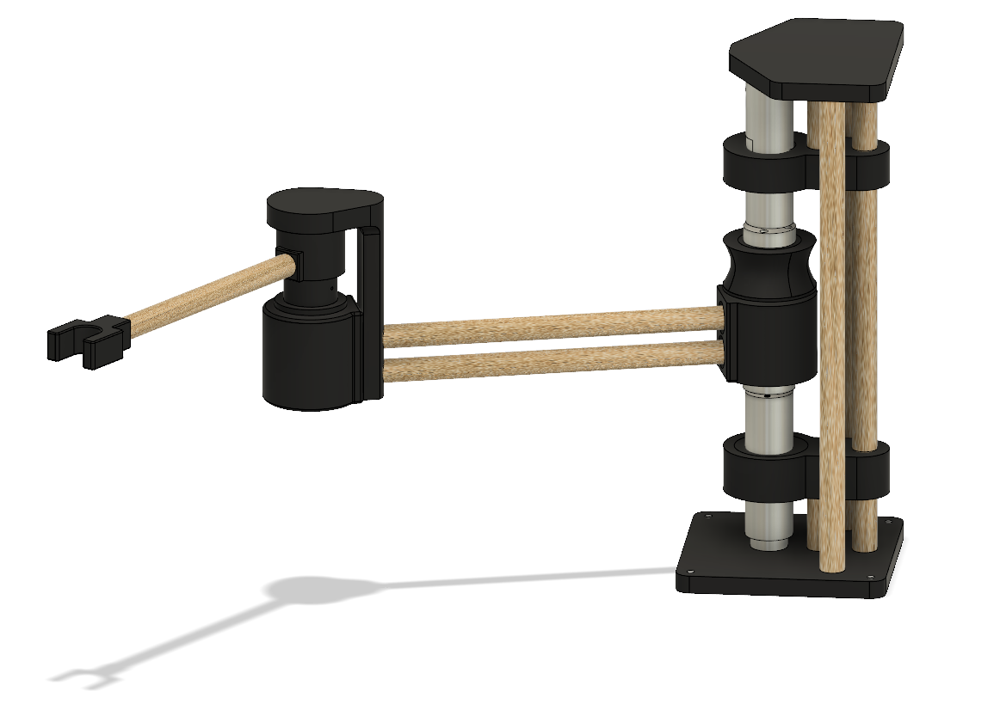
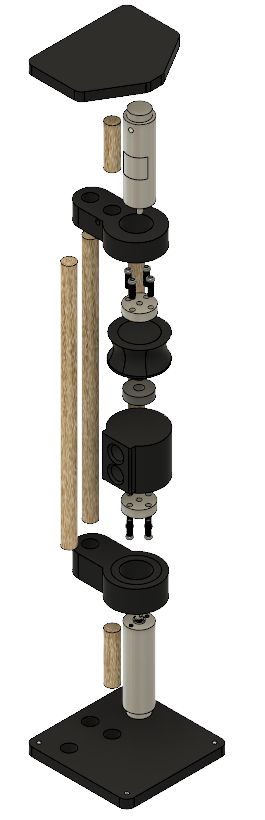
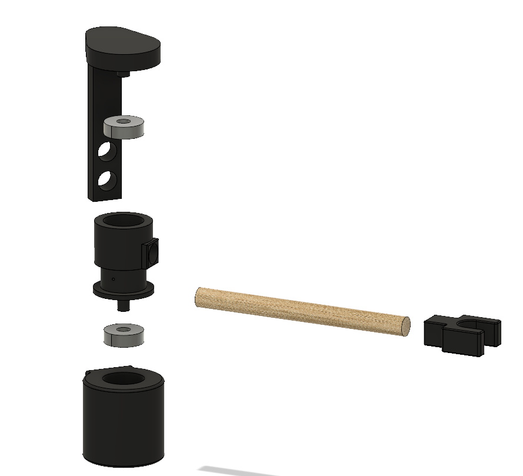
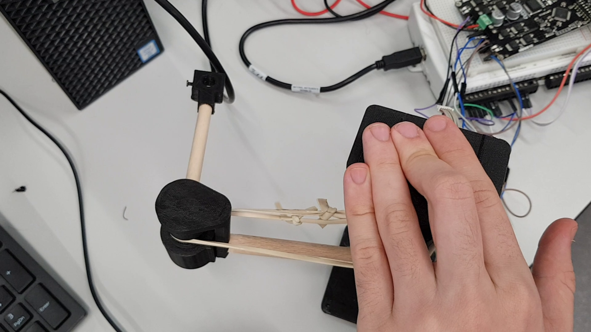
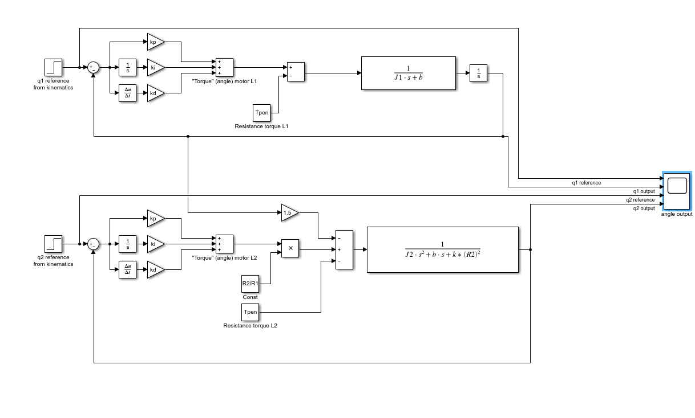
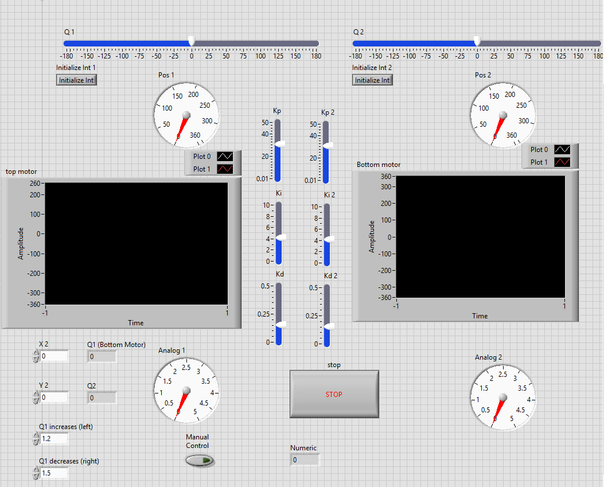
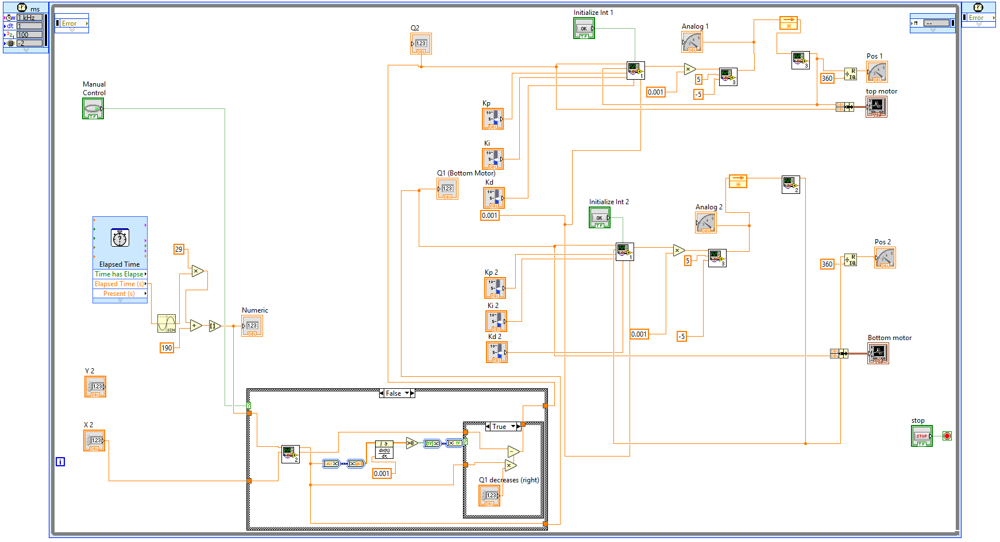

The aim of this project was to design and build a 2 revolute joint robot arm and control the end effector's 
position using inverse kinematics and PID control. The control was achieved through using the TI Lab view Development kit

This repository contains:

- Step file of the final assembly:
- Drawings of the final assembly:
- Screenshots of the development software:
- CAD files and drawings
- Lab View Files
- PID Analysis files 
- Video of the arm running: https://youtu.be/dFsoVls7F5Q

Final arm assembly:

Exploded view of base:

Exploded view of the second joint:

Final arm build:

Simulink PID control diagram:

Lab view control panel:

Lab view control block program:

